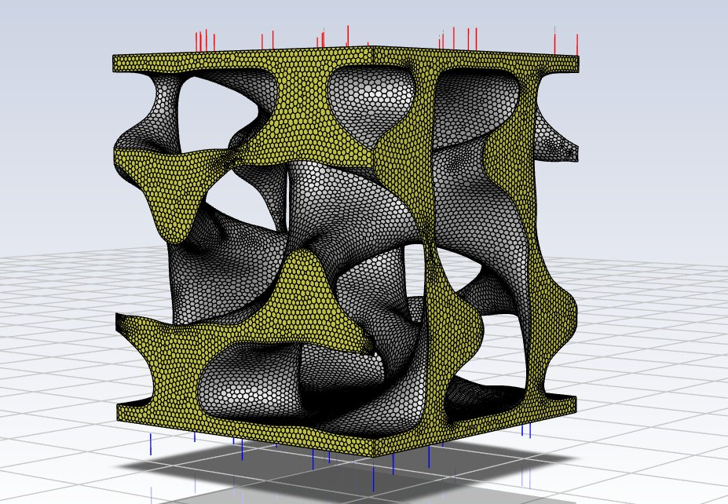
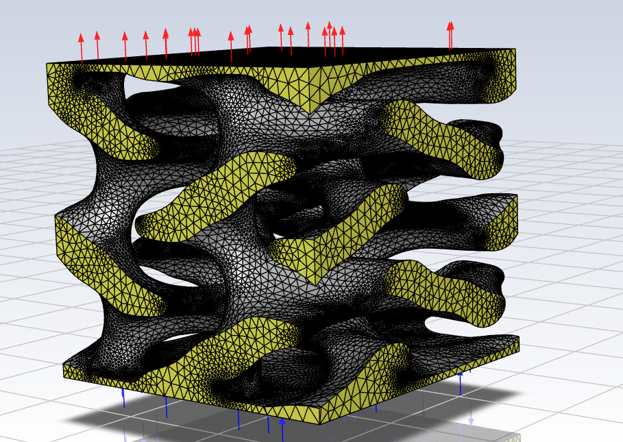
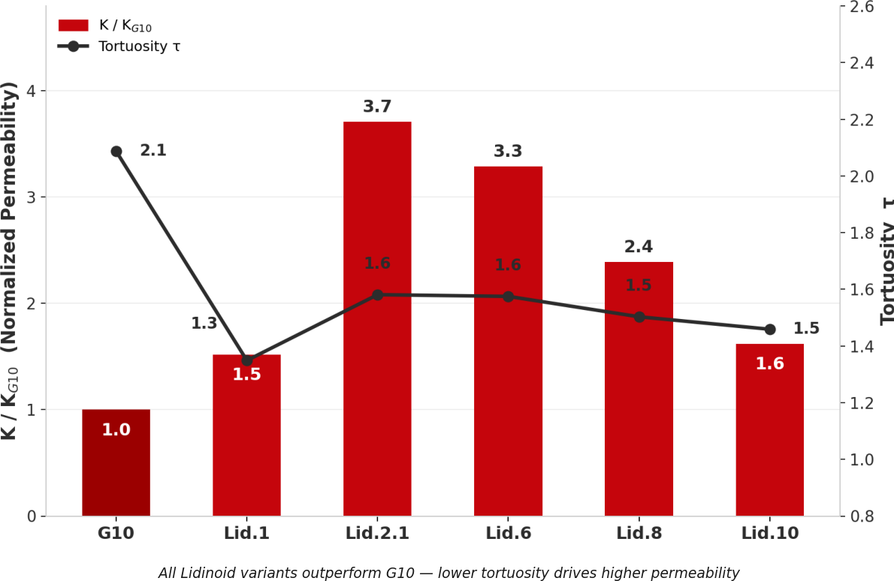
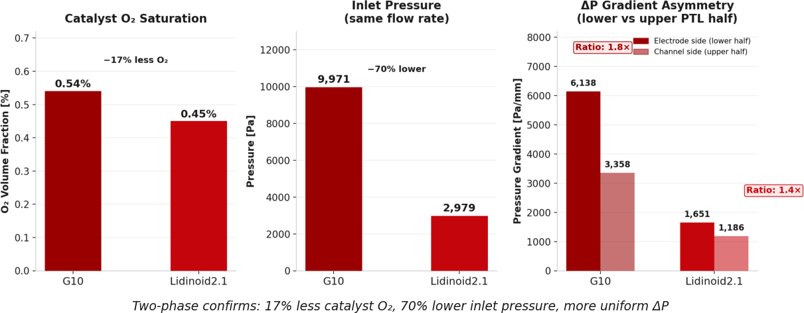

A PEM electrolyzer splits water into hydrogen and oxygen with electricity. Between the electrode where the reaction happens and the channel that feeds it sits a thin porous layer — the *porous transport layer*, or PTL — that has to do two things at once: let water in, and let the oxygen bubbles that form at the electrode get out. If the bubbles can't leave, they sit on the catalyst and block the water, and the whole thing gets less efficient the harder you push it.

The question our senior design team took on: can you design that component to outperform the mass produced commercial version? 

Early on in our literature review we found a great starting point for our research. A [paper published the previous fall](https://doi.org/10.1038/s41598-025-95399-8) had shown that 3D-printed gyroid lattices could outperform commercial sintered PTLs, and its best performer was a gyroid it called G10. That gave us our baseline and our question: if one of these surfaces beats the incumbent sintered designs, do the others beat the gyroid?

<!-- Kaya, M. F. & Kıstı, M. "Innovative anode porous transport layers for polymer
     electrolyte membrane water electrolyzers." Scientific Reports 15, 33751 (30 Sep 2025). -->

## What we made

We built the PTL out of *triply periodic minimal surfaces* — TPMS lattices, they are a smooth, self-supporting geometry you can 3D-print but not machine. Each repeating unit cell is between 1 and about 2 mm in width, depth and height. The baseline was a gyroid (called G10 in our runs). Against it we designed a family of **lidinoid** lattices at different unit-cell sizes within that range.

*The gyroid baseline, meshed for simulation. For scale: the whole cell is about 1–2 mm on a side — small enough that several would fit on a grain of rice. Water enters at the bottom face and leaves at the top; the four sides wrap around to their opposites, so the cell behaves as one tile of an infinite sheet.*

*A lidinoid unit cell, at the same 1–2 mm scale. Same boundary conditions; a visibly different way of dividing up the space.*

We simulated all of them in ANSYS Fluent two ways:

1. **Single-phase**: push water through slowly enough that the flow is purely viscous, measure the pressure drop, and back out the Darcy permeability and the *tortuosity* — how much longer the actual path through the pores is than a straight line.
2. **Two-phase**: add the electrochemistry. I wrote a small C function that injects oxygen into a 50-micron band at the electrode face at the rate Faraday's law says it should for 10,000 A/m², and consumes water to match. Then watch where the gas goes.

Every lidinoid beat the gyroid by our metrics. The best one, at a 2.21 mm unit cell, had **3.7× the permeability** of the baseline, because its tortuosity was 24–35% lower — the pores run more directly through the plane.

*Single-phase results: permeability relative to the gyroid (bars) and tortuosity (line). Lower tortuosity, higher permeability, every time.*

In two-phase, the same geometry showed **70% lower inlet pressure** and **17% less oxygen** sitting in the catalyst zone, with a more even pressure gradient from bottom to top.

*Two-phase results with oxygen generation switched on. The cheap single-phase simulation had already predicted this ranking.*

Two honest footnotes. The lidinoids are also more porous (39% vs 23%), so some of the gain is simply more hole — though even per unit of porosity they win, and the cheap single-phase simulation predicted the ranking of the expensive two-phase one every time. And the two-phase model we ended up with leaves out the force I'd most want in — more on that below.

## What actually happened

We went through a number of roadblocks in the process. 

- **The model I wanted is the one that crashed.** In a pore this small, capillary forces — surface tension pulling the gas–liquid interface around — are, I think, the most important physics in the problem, and the sharp-interface model (VOF) is the one that resolves them. It died on a single degenerate mesh cell the meshing tool had left behind — which turned out to be not easy to reliably find and fix — at a Courant number over 250. The mixture model produced no sustained flow at all, because without gravity there was nothing driving the phases apart. What finally ran was the Eulerian dispersed-bubble model, which tracks where the two phases go but treats the bubbles as a cloud of fixed 50-micron spheres. It gave us usable comparisons between geometries. It did not give us the capillary physics, and the two-phase numbers above should be read with that in mind.
- **Fluent will tell you it has converged after one iteration** if the starting residuals happen to be below its threshold. We found this was a sign that the mass generation function wasn't firing and that no oxygen was being generated at all. 
- **The metric we planned to compare on was meaningless once we switched our simulation from transient to steady state .** In a steady state simulation, the solver finds the time-independent solution, the values that the system settles to after a disturbance in its equilibrium.  "Oxygen escape efficiency" — gas out over gas generated — is ~100% for *any* converged solution, because that's what conservation of mass means. Using that metric for a steady model, wont distinguish a good PTL from a bad one because it will always be unity. We switched to local saturation and pressure after realizing that. 
- **The GUI silently discarded our source terms** after switching multiphase models. The function was compiled, loaded, and connected to nothing. Assigning through the text interface instead was the only fix.

Every one of those were human errors: the software was doing exactly what it was designed to do, discovering the errors required critical analysis of the results and reminded us the importance of our own comprehension of the model we were building and its underlying physics.  

## What it taught me

The project not only gave me a deep respect for the power of CFD simulation, but the complexity and nuances that must be defined before building my model. I built my composure upon confrontation with errors both explicit in the program and implicit in surprising results. I learned to make mistakes early and often because through them, the nuances of software, meshing, and fluid physics gave me opportunities to discover them. 
